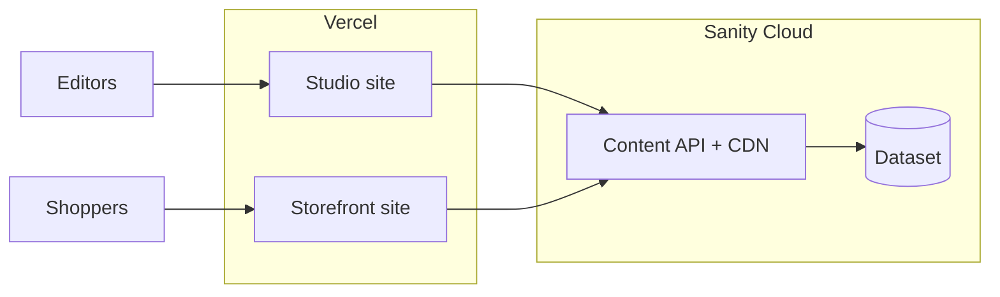

# Deploying Hijo Timepiece on Vercel

This guide walks through hosting **both** apps from this repository on [Vercel](https://vercel.com):

| Deployment | Folder | What it is |
|------------|--------|------------|
| **Storefront** | Repository root | Public watch shop (Vite + React). Shoppers use this URL. |
| **Sanity Studio** | `hijo/` | Admin UI for editors to create and **Publish** watches. |

They are **two separate Vercel projects** that connect to the **same Sanity project** (same `projectId` and `dataset`). The storefront reads published content over the public API; Studio talks to Sanity with authenticated users.

---

## 1. How the pieces fit together

- **Storefront** needs **environment variables** at build time (`VITE_SANITY_*`) so the built JavaScript knows which project and dataset to query.
- **Studio** reads **`hijo/sanity.config.ts`** and **`hijo/sanity.cli.ts`** at build time (project ID and dataset are in those files). You normally do **not** put Sanity secrets in the Studio’s Vercel env for a standard hosted Studio.
- **CORS** on the Sanity project must allow your **production storefront URL** (and preview URLs if you use them), or the browser will block API calls.

---

## 2. Prerequisites

1. **GitHub** — This repo is connected to GitHub (e.g. `Adeolu05/hijo-timepiece`).
2. **Vercel account** — Sign up at [vercel.com](https://vercel.com); “Import Git Repository” uses GitHub OAuth.
3. **Sanity project** — You already have a project (this repo’s Studio config uses project ID `jtonvz4x` and dataset `production` — change these in code if you use a different project).
4. **Align IDs** — Whatever `projectId` / `dataset` you use in **`hijo/sanity.config.ts`** must match what you set for the storefront as **`VITE_SANITY_PROJECT_ID`** and **`VITE_SANITY_DATASET`**. If they differ, the site will query the wrong backend or show demo/fallback data.

---

## 3. Sanity settings (do this before or right after first deploy)

### 3.1 CORS (required for the storefront)

1. Open [sanity.io/manage](https://sanity.io/manage) → your project → **API** (or **Settings → API**).
2. Under **CORS origins**, add:
   - Your **production storefront** URL, e.g. `https://your-store.vercel.app` or `https://www.yourdomain.com` (no trailing slash).
   - **Optional but recommended:** Vercel preview URLs are unpredictable; you can add `https://*.vercel.app` for **development/preview** only if your team is comfortable with that scope, or add each preview URL when testing.
3. Allow **credentials** only if you know you need it; the default storefront setup here uses public read — follow what your Sanity project already uses.

Without the storefront origin here, the live site will fail to load watches (blocked by the browser).

### 3.2 Dataset and published content

- The storefront reads **published** documents. In Studio, editors must click **Publish**; drafts do not appear on the public site with the default API perspective.

### 3.3 Studio authentication

- Editors sign in through **Sanity** when they open the deployed Studio URL. You manage invites in **sanity.io/manage** → **Members** (or **Team**).

---

## 4. Deploy the storefront (first Vercel project)

### 4.1 Create the project

1. Vercel Dashboard → **Add New…** → **Project**.
2. **Import** your GitHub repository.
3. Vercel will detect a root `package.json`. Configure as follows.

### 4.2 Build settings (root of repo)

| Setting | Value |
|---------|--------|
| **Framework Preset** | Vite (or “Other” if Vite is not detected) |
| **Root Directory** | `.` (leave default — repository root) |
| **Build Command** | `npm run build` |
| **Output Directory** | `dist` |
| **Install Command** | `npm install` (default) |

### 4.3 Environment variables (Production + Preview)

In the Vercel project → **Settings** → **Environment Variables**, add:

| Name | Value | Environments |
|------|--------|----------------|
| `VITE_SANITY_PROJECT_ID` | Same as `projectId` in `hijo/sanity.config.ts` | Production, Preview, Development (as needed) |
| `VITE_SANITY_DATASET` | Same as `dataset` in `hijo/sanity.config.ts` (e.g. `production`) | Same |

**Important:** Vite inlines `VITE_*` variables at **build** time. After you change env vars on Vercel, trigger a **redeploy** so the new values are baked into the bundle.

Optional: if you ever rely on `GEMINI_API_KEY` from `vite.config.ts`, add it the same way — only if you actually use that feature in production.

### 4.4 SPA routing (`vercel.json`)

This repo includes **`vercel.json`** at the **repository root** with a rewrite so all paths serve `index.html`. That is required for **React Router** (`BrowserRouter`): direct visits to `/shop`, `/product/some-slug`, or refresh on those URLs would otherwise 404 on a static host.

Vercel applies **root** `vercel.json` to this project because the Root Directory is `.`.

### 4.5 Deploy

Save settings → **Deploy**. When the build finishes, open the assigned `*.vercel.app` URL and test:

- Home, Shop, a product page, About, Cart.
- If watches do not load, check browser **Network** tab for blocked requests to Sanity → usually **CORS** or wrong **`VITE_SANITY_*`**.

---

## 5. Deploy Sanity Studio (second Vercel project)

Studio is a **separate** Vercel app whose code lives in the **`hijo/`** subdirectory.

### 5.1 Create another Vercel project

1. **Add New…** → **Project** again (do not reuse the storefront project).
2. Import the **same** GitHub repository.

### 5.2 Build settings (`hijo` as root)

| Setting | Value |
|---------|--------|
| **Framework Preset** | Other |
| **Root Directory** | `hijo` — use “Edit” next to the repo name and set the subdirectory to `hijo`. |
| **Build Command** | `npm run build` |
| **Output Directory** | `dist` |
| **Install Command** | `npm install` |

Sanity’s `npm run build` runs `sanity build`, which emits a static Studio into `hijo/dist`.

### 5.3 Environment variables

For a typical **hosted Studio** wired to Sanity Cloud, you often need **no** Vercel env vars — `projectId` and `dataset` come from **`hijo/sanity.config.ts`**.

You **may** need variables only in special cases (custom tooling, private plugins, etc.). Follow Sanity’s docs if you add those.

### 5.4 SPA routing for Studio

This repo includes **`hijo/vercel.json`** with the same rewrite pattern so deep links and client-side routes inside Studio keep working after refresh.

### 5.5 First-time Sanity deploy / login

Building on Vercel does **not** replace `sanity login` for local CLI use. If you use `sanity deploy` to Sanity’s own hosting in the future, that’s separate from Vercel. On Vercel, the **build** just runs `npm run build` in `hijo/`.

### 5.6 Deploy and verify

Deploy, then open the Studio URL:

- Log in with Sanity.
- Open **Watch** documents, confirm you can edit and **Publish**.
- Confirm the storefront (with correct env) shows published changes.

---

## 6. Optional: custom domains

For **each** Vercel project:

1. **Settings** → **Domains** → add `www.yoursite.com` (storefront) and e.g. `studio.yoursite.com` (Studio).
2. Follow Vercel’s DNS instructions.
3. Add the **storefront** canonical URL to Sanity **CORS** (include `https://`).

---

## 7. Branch deployments and Preview

- Every Git branch / PR can get a **Preview Deployment** on both projects if enabled in Vercel.
- Each preview storefront URL must be allowed in Sanity **CORS** if you want previews to load live Sanity data — or use a wildcard strategy you accept for your org.

Remember: changing **Preview** env vars still requires a new build for `VITE_*` to update.

---

## 8. Production checklist

Use this before calling the launch “done”:

- [ ] Storefront Vercel project: Root `.`, build `npm run build`, output `dist`.
- [ ] Storefront env: `VITE_SANITY_PROJECT_ID`, `VITE_SANITY_DATASET` match `hijo/sanity.config.ts`.
- [ ] Sanity **CORS** includes production storefront URL (and preview strategy if needed).
- [ ] Studio Vercel project: Root `hijo`, build `npm run build`, output `dist`.
- [ ] `vercel.json` present at repo root **and** under `hijo/` (already in this repo).
- [ ] At least one **Watch** document is **Published** and appears on the shop.
- [ ] Direct navigation works: open `/shop` and `/product/<slug>` in a new tab (confirms SPA rewrite).
- [ ] Editors can access Studio URL and publish without using your laptop.

---

## 9. Troubleshooting

| Symptom | Likely cause |
|---------|----------------|
| Storefront shows no products / errors in console “CORS” | Add the exact storefront origin (scheme + host) in Sanity CORS. |
| Wrong or empty catalog | `VITE_SANITY_PROJECT_ID` / `DATASET` mismatch vs Studio config; or content not **Published**. |
| Env changed but site unchanged | Redeploy — Vite bakes `VITE_*` at build time. |
| 404 on refresh on `/shop` or `/product/...` | Missing root `vercel.json` rewrite, or wrong Vercel project root. |
| Studio build fails on Vercel | Check **Root Directory** is `hijo` and Node version (Vercel **Settings** → **General** → Node.js 20.x recommended). |
| Studio loads but cannot log in | Sanity project membership / invite; not a Vercel env issue in the default setup. |
| `sanity build` warns about **appId** / auto-updates | Optional: in [sanity.io/manage](https://sanity.io/manage) → your project → **Studios**, configure an app id and add it under `deployment` in `hijo/sanity.cli.ts` so Studio versioning is explicit. Builds still succeed without it. |

---

## 10. Updating after you push to GitHub

Both Vercel projects watch the same repository (different root directories). Pushing to the connected branch (usually `main`) triggers:

- Storefront rebuild from repo root.
- Studio rebuild from `hijo/`.

If only one subtree changed, both may still rebuild depending on Vercel settings; that is normal and keeps deployments in sync.

---

## 11. Security notes (short)

- Do **not** commit Sanity **write** tokens or personal API keys to the repo.
- The storefront uses the **public** read pattern; `projectId` appears in the browser by design.
- Restrict **Sanity project** membership; remove people who leave.

---

## 12. File reference

| File | Role |
|------|------|
| `vercel.json` (root) | SPA fallback for the React storefront. |
| `hijo/vercel.json` | SPA fallback for Sanity Studio. |
| `hijo/sanity.config.ts` | Studio `projectId` / `dataset` (must align with storefront env). |
| `src/lib/sanity.ts` | Storefront Sanity client; uses `VITE_SANITY_*`. |

For day-to-day Sanity operations (Vision, datasets, etc.), see `sanity/OPERATIONS.md` in this repository.
